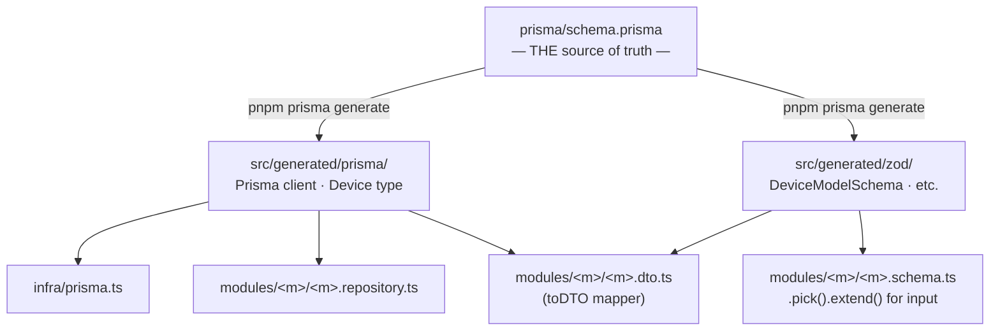
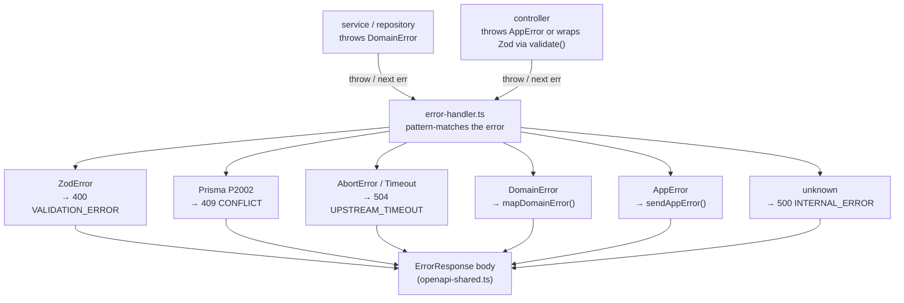

# Contributing to eb-auth

This guide is for developers actively working on the codebase. For a
quick "what is this?" overview, read [README.md](README.md) first.

## Table of contents

1. [Setup & daily workflow](#setup--daily-workflow)
2. [Project structure](#project-structure)
3. [How errors and types flow](#how-errors-and-types-flow)
4. [Conventions (do this)](#conventions-do-this)
5. [Anti-patterns (don't do this)](#anti-patterns-dont-do-this)
6. [How-to recipes](#how-to-recipes)
7. [Debugging](#debugging)
8. [Pre-commit, CI, and deploy](#pre-commit-ci-and-deploy)

> **Two reference implementations**:
>
> - Feature module (owns its own DB table, has CRUD): `src/modules/devices/`
> - Integration module (wraps an external API/service): `src/modules/shop/`

---

## Setup & daily workflow

```bash
# First time
docker compose up -d                     # Postgres + Redis
cp .env.example .env                     # then fill in values
pnpm install                             # also installs the pre-commit hook
pnpm prisma generate                     # writes src/generated/{prisma,zod}/
pnpm prisma migrate dev                  # creates the local DB schema

# Daily
pnpm dev                                 # tsx watch — fast hot reload
pnpm test:watch                          # vitest in watch mode (separate terminal)
```

If you change `prisma/schema.prisma`, **always** run `pnpm prisma generate`
afterwards. The `pnpm build` script does it for you, but `pnpm dev` does
not — it picks up the change but the generated `Device` type / Zod
schema won't update until you regenerate.

## Project structure

```
src/
├── config/                 zod-validated env (config/env.ts)
├── infra/                  process-wide singletons
│   ├── prisma.ts           PrismaClient + PrismaPg adapter
│   ├── redis.ts            ioredis client
│   ├── logger.ts           pino root + getLogger() bound to ALS
│   ├── request-context.ts  AsyncLocalStorage<{ requestId, userId }>
│   └── metrics.ts          prom-client registry
├── middleware/             request-scoped middleware (one concern per file)
│   ├── request-context.ts  assigns x-request-id + opens ALS scope
│   ├── drain.ts            503s new requests during graceful shutdown
│   ├── http-logger.ts      pino-http
│   ├── metrics.ts          per-request Prometheus
│   ├── security.ts         helmet (strict CSP / HSTS / CORP)
│   ├── rate-limit.ts       Redis-backed limiters
│   ├── auth-guard.ts       Better Auth session check
│   ├── validate.ts         Zod-driven validation factory
│   ├── async-handler.ts    promise → next(err) wrapper
│   └── error-handler.ts    THE central error handler
├── modules/                feature modules — one folder each
│   ├── index.ts            module REGISTRY (single source of truth)
│   ├── auth/               Better Auth + auth router
│   │   └── post-signup-hooks.ts  push-based hook registry for post-signup logic
│   ├── devices/            CRUD feature module — use as template for new features
│   ├── shop/               Medusa integration — use as template for new integrations
│   └── health/             /livez /readyz /health
├── http/                   the Express app itself
│   ├── app.ts              createApp() — builds the app, no listen
│   ├── server.ts           bootstrap + graceful shutdown
│   ├── openapi.ts          merges per-module paths into one OpenAPI doc
│   └── openapi-shared.ts   ERROR_CODES, errorResponseSchema, paginatedResponse
├── errors/
│   ├── app-error.ts        AppError class + factories (notFound, conflict, ...)
│   └── domain.ts           DomainError base + per-module domain errors
├── types/
│   └── express.d.ts        global Express Request augmentation
└── generated/              git-ignored
    ├── prisma/             Prisma 7 client (prisma-client generator)
    └── zod/                zod schemas auto-generated from schema.prisma
```

### A feature module is exactly these files

```
src/modules/<feature>/
├── index.ts                public API (router + openapi paths)
├── <feature>.routes.ts     Express router (mount validate() + asyncHandler)
├── <feature>.controller.ts arrow-function methods, Response<T> generic
├── <feature>.service.ts    business logic; throws DomainError
├── <feature>.repository.ts Prisma calls only
├── <feature>.schema.ts     Zod input schemas (built on generated zod)
├── <feature>.dto.ts        Zod response schema + toDeviceDTO mapper
├── <feature>.openapi.ts    OpenAPI paths + per-endpoint Response types
└── <feature>.schema.test.ts (or *.service.test.ts, *.repository.test.ts)
```

Use `src/modules/devices/` as the canonical reference. Copy its layout
when adding a new module.

## How errors and types flow

### Type flow (data shapes)



**Rule**: never define a Device-shaped Zod schema by hand. Always
`DeviceModelSchema.pick({...}).extend({...})`. Renaming a column in
`schema.prisma` then surfaces as a typecheck error in every consumer.

### Error flow



**Rule**: there is exactly one place that constructs error response
bodies: `src/middleware/error-handler.ts`. If you find yourself writing
`res.status(4xx).json({ error: ... })` outside of that file, you're
doing it wrong — throw via `next(err)` instead.

## Conventions (do this)

### Imports

- **No `.js` extensions.** `tsconfig.json` uses `moduleResolution: Bundler`.
  Write `from "./devices.service"`, not `from "./devices.service.js"`.
- **Cross-module imports go through the barrel.** Inside `src/modules/devices/`,
  import siblings directly: `import { devicesService } from "./devices.service"`.
  Outside the module, import only from the barrel:
  `import { devicesRouter, devicesPaths } from "../modules/devices"`.
- **Generated files are off-limits to humans.** Never edit
  `src/generated/{prisma,zod}/`. They're git-ignored and overwritten on
  every `prisma generate`.

### Validation & schemas

- **Validate in middleware, not in controllers.** Apply
  `validate({ body, query, params })` at the route level. The controller
  reads `req.validated.body` (typed via `ValidatedRequest<T>`).
- **Build Zod schemas from the generated `*ModelSchema`.** Hand-written
  `z.object({...})` for DB-shaped data is a drift risk.
- **Use `.meta({ id: "..." })`** on response schemas so they show up in
  the OpenAPI document as named components.

### Errors

- **Throw, never write.** Inside any handler/middleware, do
  `next(notFound("..."))` not `res.status(404).json(...)`.
- **Use the factories in `app-error.ts`.** Never `new AppError(...)`
  directly — the factories enforce the (status, code) pairing.
- **Service layer throws `DomainError`, not `AppError`.** HTTP semantics
  belong at the request boundary, not in business logic.
- **New error codes go in `ERROR_CODES`** in `openapi-shared.ts`. The
  type system catches typos and the OpenAPI doc publishes the closed set.

### Logging

- **Use `getLogger()`, not the bare `logger`.** `getLogger()` returns a
  pino child logger bound to the active request id (and user id, after
  auth-guard runs). Bare `logger` works but loses request correlation.
- **Never `console.log`.** ESLint flags it. Pino redacts secrets;
  `console` doesn't.
- **Log objects, not interpolated strings.** `logger.info({ deviceId },
"registered")` is searchable; ``logger.info(`registered ${deviceId}`)``
  is not.

### Types

- **Bracket access for index signatures.** `tsconfig.json` enables
  `noPropertyAccessFromIndexSignature`. Write `process.env["FOO"]`,
  `req.params["id"]`, `(user as Record<string, unknown>)["isAdmin"]`.
- **`exactOptionalPropertyTypes: true`** is on. Optional properties
  cannot be assigned `undefined` — build the object conditionally.
- **Use `Response<T>` in controllers** so `res.json(...)` is type-checked
  against the per-endpoint response schema exported from `*.openapi.ts`.

### Comments

- **Explain _why_, not _what_.** Code shows what; comments capture the
  rationale ("we use forks pool because Prisma client is a singleton").
- **Top-of-file JSDoc** on every infra/middleware file should explain
  the file's purpose and how it fits into the bigger picture.

## Anti-patterns (don't do this)

| ❌ Don't                                                                                      | ✅ Do                                                              |
| --------------------------------------------------------------------------------------------- | ------------------------------------------------------------------ |
| `res.status(404).json({...})` in middleware                                                   | `next(notFound("..."))`                                            |
| `new AppError(404, "NOT_FOUND", ...)`                                                         | `notFound("...")`                                                  |
| `throw new AppError(...)` from a service                                                      | `throw new DomainError(...)`                                       |
| `schema.parse(req.body)` in a controller                                                      | `validate({ body: schema })` middleware                            |
| Hand-written `z.object({ id, deviceId, ... })`                                                | `DeviceModelSchema.pick({...}).extend({...})`                      |
| `z.string().url()` / `z.string().uuid()` (deprecated in zod 4)                                | `z.url()` / `z.uuid()`                                             |
| `import { devicesService } from "../modules/devices/devices.service"` from outside the module | `import { devicesRouter } from "../modules/devices"` (barrel only) |
| `import { ... } from "./foo.js"`                                                              | `import { ... } from "./foo"` (no `.js`)                           |
| `console.log("debug")`                                                                        | `getLogger().debug({ ... }, "msg")`                                |
| `req.params.id`                                                                               | `req.params["id"]` (or use `validate({ params })`)                 |
| `process.env.PORT`                                                                            | `process.env["PORT"]` (or import from `config/env.ts`)             |
| Module-local `errorHandler` mount                                                             | Rely on the global one in `app.ts`                                 |
| Async function with no `await`                                                                | Drop `async`, return `Promise.resolve()` if needed                 |
| `as any` casts                                                                                | Define a narrow local interface and cast through that              |

## How-to recipes

### Add a new external service integration (integration module)

Use this recipe when you're connecting to a third-party REST API, SaaS platform,
or any external service — a payment provider, email/SMS service, search index,
analytics backend, etc. The canonical reference implementation is `src/modules/shop/`.

The defining property of this pattern: adding or removing the integration touches
**zero core files** except two lines in `src/modules/index.ts`.

#### 1. Create the module folder

```bash
mkdir src/modules/<integration>
```

Create these files (replace `<m>` with your integration name, e.g. `email`):

```
src/modules/<m>/
├── index.ts          ← ONLY public export: create<M>Module() → AppModule | null
├── <m>.config.ts     ← module-local Zod env schema + load<M>Config()
├── <m>.client.ts     ← HTTP client (typed methods for calls your code makes itself)
├── <m>.errors.ts     ← DomainError subclasses + map<M>DomainError()
└── <m>.repository.ts ← (if needed) Prisma calls for the module's own tables
```

Add a proxy router file if you're forwarding browser requests to the upstream:

```
├── <m>.proxy.ts      ← Router.all("/<prefix>/*splat") catch-all proxy
```

Add a provisioning file if users need a linked account in the external system:

```
└── <m>.provision.ts  ← 3-layer fallback chain (see below)
```

#### 2. Module-local env validation (`<m>.config.ts`)

Do **not** add vars to `src/config/env.ts`. Keep them here:

```ts
import { z } from "zod";

// Treat blank strings as absent — .env files often have VAR= with no value.
const blankAsUndefined = (v: unknown): unknown =>
  typeof v === "string" && v.trim() === "" ? undefined : v;

const Schema = z.object({
  <M>_ENABLED: z.string().optional().transform((v) => v === "true"),
  <M>_API_URL:   z.preprocess(blankAsUndefined, z.url().optional()),
  <M>_API_TOKEN: z.preprocess(blankAsUndefined, z.string().min(1).optional()),
  // ...more vars
});

export interface <M>Config { enabled: boolean; apiUrl: string; apiToken: string; }

export function load<M>Config(): <M>Config | null {
  const parsed = Schema.safeParse(process.env);
  if (!parsed.success) throw new Error(`<M> env validation failed: ...`);
  const env = parsed.data;
  if (!env.<M>_ENABLED) return null;    // ← master switch; returns null = disabled

  // Collect ALL missing vars before throwing (one complete error message > many).
  const missing: string[] = [];
  if (!env.<M>_API_URL)   missing.push("<M>_API_URL");
  if (!env.<M>_API_TOKEN) missing.push("<M>_API_TOKEN");
  if (missing.length > 0)
    throw new Error(`<M>_ENABLED=true but missing: ${missing.join(", ")}`);

  return { enabled: true, apiUrl: env.<M>_API_URL!, apiToken: env.<M>_API_TOKEN! };
}
```

#### 3. Domain errors (`<m>.errors.ts`)

```ts
import { DomainError } from "../../errors/domain";
import { serviceUnavailable } from "../../errors/app-error";
import type { AppError } from "../../errors/app-error";

export class <M>ProvisioningError extends DomainError {
  readonly kind = "<M>ProvisioningError" as const;
  constructor(public readonly userId: string, cause: unknown) {
    super(`Failed to provision <M> account for user ${userId}`);
    this.cause = cause;
  }
}

// Registered via AppModule.mapDomainError — no edits to error-handler.ts needed.
export function map<M>DomainError(err: DomainError): AppError | undefined {
  if (err instanceof <M>ProvisioningError) return serviceUnavailable(err.message);
  return undefined;
}
```

#### 4. The factory (`index.ts`)

```ts
import type { AppModule } from "..";
import { registerUserCreateHook } from "../auth/post-signup-hooks";
import { load<M>Config } from "./<m>.config";
import { create<M>Client } from "./<m>.client";
import { map<M>DomainError } from "./<m>.errors";
// import { create<M>ProxyRouter } from "./<m>.proxy";  // if you have a proxy
// import { create<M>Provisioner, makeBetterAuthUserCreateHook } from "./<m>.provision"; // if provisioning

export function create<M>Module(): AppModule | null {
  const config = load<M>Config();
  if (!config) return null;   // disabled — registry skips it, no log spam

  const client = create<M>Client(config);

  // Only needed if users need linked accounts in the external system:
  // const provisioner = create<M>Provisioner(client);
  // registerUserCreateHook(makeBetterAuthUserCreateHook(provisioner));

  // Only needed if you have a proxy router:
  // const router = create<M>ProxyRouter({ config, client });

  return {
    mountPath: "/api/<m>",
    router,                        // or a minimal router if no proxy
    mapDomainError: map<M>DomainError,
  };
}
```

#### 5. Register in `src/modules/index.ts`

Add exactly **two lines** to the optional modules block at the bottom:

```ts
import { create<M>Module } from "./<m>";   // line 1

const <m> = create<M>Module();
if (<m>) optionalModules.push(<m>);        // line 2
```

That's the entire core-file footprint. Nothing else changes.

#### 6. Add env vars to `.env` / `.env.example`

Document them with a comment block similar to the existing `SHOP_ENABLED` section.

#### 7. If you need a linked account per user (provisioning)

Implement the **3-layer fallback chain** in `<m>.provision.ts`:

1. **Mapping table fast path** — your own DB table (`user_<m>_profile` or similar). `O(1)`, no upstream call.
2. **Find-by-email/ID recovery** — if mapping is absent, query the upstream. The record may exist from a half-completed prior attempt, a backup/restore, or an admin action. Link to it rather than creating a duplicate. Failure here is non-fatal — fall through to Layer 3.
3. **Create + collision recovery** — POST to the upstream to create the account. On a collision error (another request raced you), retry the find. Only throw `<M>ProvisioningError` when both the create AND the recovery find fail — that's a genuine "upstream is hard-down" signal.

Add an **in-process inflight dedup map** (`Map<userId, Promise<string>>`) to coalesce concurrent calls for the same user within one process. Clear the entry in `.finally()` so a subsequent retry after failure can try again fresh.

Register the signup hook as **fire-and-forget** (don't await; swallow the error after logging) so an upstream outage never blocks user registration.

#### 8. If you need a proxy router

- Use `Router.all("/<prefix>/*splat")` as the catch-all.
- Call `ensureCustomerForUser` (or equivalent) at the top of every authenticated request as the lazy-retry safety net.
- Strip hop-by-hop headers from both the incoming request and the upstream response.
- Inject required upstream headers server-side (`Authorization`, API keys, etc.).
- Buffer the upstream response body **once** (`await upstream.text()`), then decide whether to intercept or forward — never read `.text()` twice on the same `Response`.
- Rewrite upstream error envelopes into our standard `ErrorResponse` shape.

#### Detachment recipe (how to remove the integration)

1. `rm -rf src/modules/<m>`
2. Remove the import + two lines in `src/modules/index.ts`
3. Drop any Prisma models added for the integration from `schema.prisma`
4. `pnpm prisma migrate dev --name drop_<m>_integration`
5. Remove any infrastructure the integration added (containers, volumes, etc.)

Zero edits to core files (`env.ts`, `error-handler.ts`, `app.ts`, `auth.ts`).

---

### Add a new feature module

```bash
mkdir src/modules/widgets
```

Create these files (use `src/modules/devices/` as a template):

1. `widgets.schema.ts` — Zod input schemas via `WidgetModelSchema.pick(...)`
2. `widgets.dto.ts` — `widgetDTOSchema` from `WidgetModelSchema.extend(...)`, `toWidgetDTO()`
3. `widgets.repository.ts` — Prisma calls only
4. `widgets.service.ts` — business logic, throws `DomainError`
5. `widgets.controller.ts` — arrow-function methods with `Response<T>`
6. `widgets.routes.ts` — `validate()` + `asyncHandler()` per route
7. `widgets.openapi.ts` — `widgetsPaths: ZodOpenApiPathsObject` + per-endpoint response schemas
8. `index.ts` — barrel: `export { widgetsRouter, widgetsPaths }`

Then register in `src/modules/index.ts`:

```ts
import { widgetsPaths, widgetsRouter } from "./widgets";

export const modules: AppModule[] = [
  // ...
  { mountPath: "/api/widgets", router: widgetsRouter, openapi: widgetsPaths },
];
```

That's it — `createApp()` and `buildOpenApiDocument()` both pick it up
from the registry. No edits to `app.ts` or `openapi.ts` needed.

### Add an endpoint to an existing module

1. Add the input schema to `<m>.schema.ts` (build from the generated
   model schema where possible).
2. Add the response schema to `<m>.openapi.ts`, export both the schema
   and the inferred TS type.
3. Add the controller method (arrow function, `Response<T>` typed).
4. Add the route in `<m>.routes.ts` with `validate()` + `asyncHandler()`.
5. Add the path entry to `<m>Paths` in `<m>.openapi.ts`.

### Add a new error code

1. Open `src/http/openapi-shared.ts`.
2. Add the new constant to `ERROR_CODES`:
   ```ts
   PAYMENT_REQUIRED: "PAYMENT_REQUIRED",
   ```
3. Add a factory to `src/errors/app-error.ts`:
   ```ts
   export function paymentRequired(message = "Payment required."): AppError {
     return new AppError(402, ERROR_CODES.PAYMENT_REQUIRED, message);
   }
   ```
4. Use it: `throw paymentRequired("Subscription expired.")`. The OpenAPI
   document automatically lists the new code in its enum on the next
   build.

### Add an env var

1. Add to the Zod schema in `src/config/env.ts` with a sensible default
   or `min(1)` if required.
2. Document it in `.env.example` with a comment explaining what it does.
3. Read it via `env.MY_NEW_VAR` (typed and validated at boot).

### Add a database column

1. Edit `prisma/schema.prisma`.
2. Run `pnpm prisma generate` to update the generated client and zod schemas.
3. Run `pnpm prisma migrate dev --name add_widget_color` to create the
   migration and apply it to your local DB.
4. If the new column should be exposed on the API, add it to the
   relevant `*.dto.ts` mapper (`toWidgetDTO`) — typecheck will tell you
   what to update.

### Add a domain error

1. Open `src/errors/domain.ts`.
2. Add a new class extending `DomainError`:
   ```ts
   export class WidgetOutOfStockError extends DomainError {
     readonly kind = "WidgetOutOfStockError" as const;
     constructor(public readonly widgetId: string) {
       super(`Widget ${widgetId} is out of stock.`);
     }
   }
   ```
3. Add a branch in `mapDomainError()` in `src/middleware/error-handler.ts`:
   ```ts
   if (err instanceof WidgetOutOfStockError) return conflict(err.message);
   ```
4. Throw from the service layer: `throw new WidgetOutOfStockError(id)`.

### Write a test

Tests are colocated next to the code: `widgets.service.test.ts` lives
in the same folder as `widgets.service.ts`.

```ts
import { describe, it, expect } from "vitest";
import { devicesService } from "./devices.service";

describe("devicesService.create", () => {
  it("uppercases the MAC address", async () => {
    // ...
    expect(actual.macAddress).toBe("AA:BB:CC:DD:EE:FF");
  });
});
```

Run with `pnpm test` (CI mode), `pnpm test:watch` (interactive), or
`pnpm test:coverage` (with v8 coverage report).

## Debugging

### Tail the dev server logs nicely

`pnpm dev` already pipes pino through `pino-pretty`. If you want JSON
output (e.g. to grep for a request id), run:

```bash
LOG_LEVEL=debug NODE_ENV=production pnpm dev
```

(That bypasses the pretty transport. Use sparingly.)

### Find a request in the logs

Every request gets an `x-request-id` header (set by `requestContext`
middleware). Errors return that id in `ErrorResponse.requestId`. Search
the log stream for `reqId=<id>` to see every line for that request.

### Inspect the OpenAPI document

```bash
curl http://localhost:3000/api/openapi.json | jq .paths
```

Or open `http://localhost:3000/api/docs` for the Scalar reference UI.

### Inspect Prometheus metrics

```bash
curl http://localhost:3000/metrics
```

### Database

```bash
pnpm prisma:studio        # browse the DB in a web UI
docker exec -it eb-auth-postgres psql -U eb_auth eb_auth   # raw psql
```

### Redis

```bash
docker exec -it eb-auth-redis redis-cli
> KEYS auth:*           # Better Auth session keys
> KEYS rl:*             # rate limiter keys
```

## Pre-commit, CI, and deploy

### Pre-commit hook

`pnpm install` registers a hook via `simple-git-hooks` that runs
`lint-staged` on the files you're about to commit:

- `*.{ts,tsx,js,mjs,cjs}` → `eslint --fix` + `prettier --write`
- `*.{json,md,yml,yaml}` → `prettier --write`

If the hook prevents a commit, fix the reported issue. Don't bypass it
with `--no-verify` unless you know exactly why.

### CI

`.github/workflows/ci.yml` runs on every push and PR:

```
typecheck → lint → test → build
```

with Postgres and Redis service containers. A failure here is a hard
block — fix it locally before pushing again.

### Production build

```bash
pnpm build       # prisma generate && tsdown
pnpm start       # node --enable-source-maps dist/server.mjs
```

The Dockerfile does both in a multi-stage build. The runtime image is
`node:24-alpine` + production deps + `dist/` + `src/generated/`.

## Things to check before opening a PR

- [ ] `pnpm typecheck` passes
- [ ] `pnpm lint` passes
- [ ] `pnpm test` passes
- [ ] `pnpm build` produces a runnable bundle
- [ ] If you added an endpoint, the OpenAPI doc shows it (`/api/docs`)
- [ ] If you added env vars, they're in `.env.example` with a comment
- [ ] If you added a Prisma column, the migration is committed
- [ ] If you touched error handling, the error response still satisfies
      `ErrorResponse` (the `satisfies` clauses will tell you)
- [ ] Comments explain _why_, not _what_

If you added an **integration module**:

- [ ] Only `src/modules/index.ts` was changed among core files (import + conditional push)
- [ ] Env vars live in `<m>.config.ts`, not in `src/config/env.ts`
- [ ] Domain errors use the `AppModule.mapDomainError` hook, not a branch in `error-handler.ts`
- [ ] Post-signup hooks are registered via `registerUserCreateHook()`, not imported in `auth.ts`
- [ ] The integration can be fully removed by deleting its folder + 2 lines in `index.ts`
