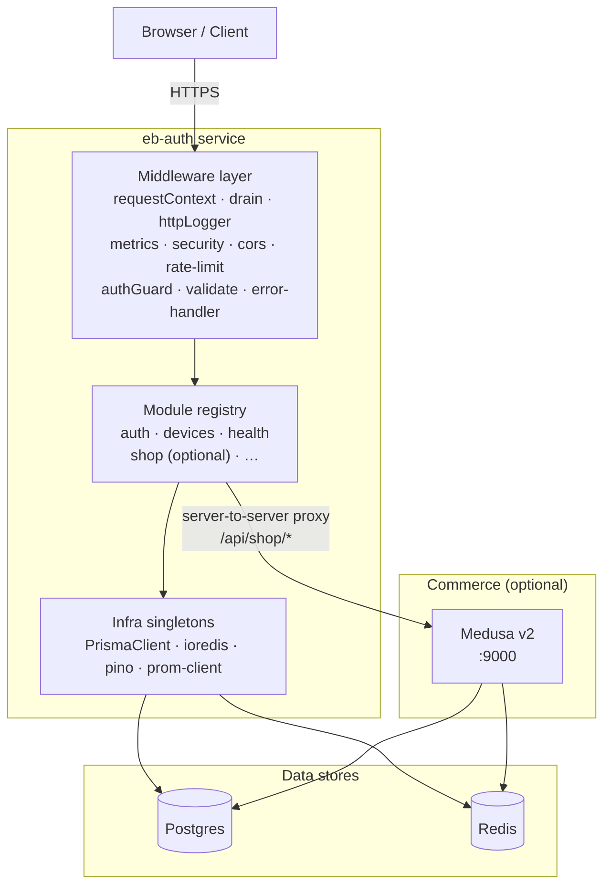
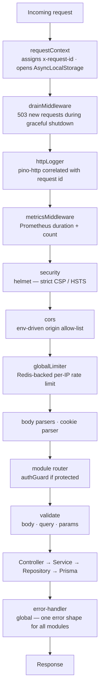

# eb-auth

Authentication & device-management service. Express 5 + Better Auth +
Prisma 7 + Postgres + Redis.

## Quick start

```bash
# 1. Boot Postgres + Redis locally
docker compose up -d

# 2. Install deps
pnpm install

# 3. Configure env
cp .env.example .env
# (edit .env — at minimum, set GOOGLE_CLIENT_ID/SECRET if you want OAuth)

# 4. Generate Prisma client + push schema to local DB
pnpm prisma generate
pnpm prisma migrate dev

# 5. Run the dev server (tsx watch — fast hot reload)
pnpm dev
```

The server boots on `http://localhost:3000`. Useful endpoints:

| Path                  | What                                     |
| --------------------- | ---------------------------------------- |
| `/livez`              | Liveness probe (no deps)                 |
| `/readyz`             | Readiness probe (DB + Redis)             |
| `/metrics`            | Prometheus metrics (process + HTTP)      |
| `/api/openapi.json`   | OpenAPI 3.1 document for our routes      |
| `/api/docs`           | Scalar interactive API reference         |
| `/api/auth/reference` | Better Auth's own auth-routes reference  |
| `/api/auth/*`         | Better Auth (sign-in/up, sessions, etc.) |
| `/api/devices/*`      | Device management (auth required)        |

## Scripts

```bash
pnpm dev              # tsx watch — dev server with hot reload
pnpm build            # prisma generate && tsdown (prod bundle)
pnpm start            # node dist/server.mjs
pnpm typecheck        # tsc --noEmit
pnpm lint             # eslint .
pnpm lint:fix         # eslint . --fix
pnpm format           # prettier --write .
pnpm test             # vitest run
pnpm test:watch       # vitest (watch mode)
pnpm test:coverage    # vitest run --coverage
pnpm prisma:migrate   # prisma migrate dev
pnpm prisma:studio    # browse DB in Prisma Studio
```

## Architecture



### Adding a new feature module

1. Create `src/modules/<name>/` with the standard files (`*.routes.ts`,
   `*.controller.ts`, `*.service.ts`, `*.repository.ts`, `*.schema.ts`,
   `*.dto.ts`, `*.openapi.ts`).
2. Export the public API from `src/modules/<name>/index.ts` (router +
   openapi paths).
3. Add a single line to `src/modules/index.ts` registering it.

That's it — `createApp()` and `buildOpenApiDocument()` both iterate the
registry, so no other files need to change.

### Request flow



### Tracing

Logs are correlated by request id automatically:

```ts
import { getLogger } from "../infra/logger";

export async function doStuff() {
  // Includes reqId and userId from the active request, no plumbing needed.
  getLogger().info({ thing: "happened" }, "did the thing");
}
```

## Operational notes

### Scaling beyond 1 replica

The service is stateless. To scale:

- **Postgres**: put **PgBouncer** in front for >5 replicas. Adjust
  `DB_POOL_MAX` so `DB_POOL_MAX × replicas ≤ Postgres max_connections`.
- **Redis**: shared. Use a managed Redis (Upstash, ElastiCache).
- **Rate limits**: already correct cross-replica because the store is
  Redis-backed.
- **Sessions**: already shared because Better Auth uses Redis as
  `secondaryStorage`.

### Graceful shutdown

On SIGTERM/SIGINT, the server:

1. Marks itself as draining → `/readyz` returns 503 → LB pulls it from
   rotation, `drainMiddleware` 503s new requests with `Connection: close`.
2. Closes the HTTP server (waits for in-flight requests).
3. Disconnects Prisma + Redis.
4. Exits 0. Hard timeout = `SHUTDOWN_TIMEOUT_MS` (default 15s).

### Observability

- **Logs**: pino → stdout, JSON in prod (async transport, non-blocking),
  pretty in dev. Every line carries `service`, `env`, `reqId`, optionally
  `userId`.
- **Metrics**: Prometheus at `/metrics`. Includes default Node process
  metrics + per-route HTTP duration histogram and request counter.
- **Health**: `/livez` (process), `/readyz` (DB + Redis + drain flag).

## Tooling

| Concern      | Tool                                                |
| ------------ | --------------------------------------------------- |
| Runtime      | Node 24+ (native TS, ESM)                           |
| Dev runner   | tsx (`tsx watch`)                                   |
| Prod bundler | tsdown (Rolldown)                                   |
| Type-check   | tsc                                                 |
| Test runner  | Vitest 4                                            |
| Lint         | ESLint 10 (flat config) + typescript-eslint 8       |
| Format       | Prettier 3                                          |
| ORM          | Prisma 7 (`prisma-client` generator + `adapter-pg`) |
| Auth         | Better Auth 1.6 + Redis secondary storage           |
| API docs     | zod-openapi + Scalar                                |
| Pre-commit   | simple-git-hooks + lint-staged                      |
| CI           | GitHub Actions (typecheck/lint/test/build)          |
